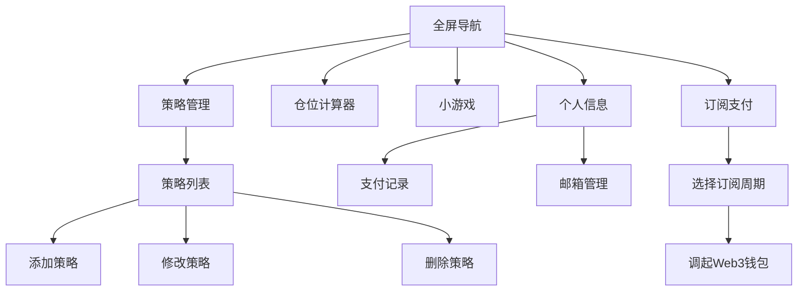

# 策略监听前端UI需求文档

## 1. 项目概述
- **目标平台**：手机端（适配TG小程序）
- **核心功能**：
  - 全屏导航（个人信息悬浮按钮 + 左右滑动页面）
  - 策略管理（添加、修改、删除）
  - 订阅支付（Web3钱包集成）
- **技术选型**：
  - 框架：React
  - UI库：Tailwind CSS
  - 支付集成：MetaMask/OKX/币安Web3钱包

## 2. 功能模块设计

### 2.1 全屏导航
- **设计**：
  - **单屏独占**：每个导航选项（策略管理、仓位计算器、小游戏、订阅支付、个人信息）独占一屏。
  - **炫酷效果**：
    - **背景动画**：动态粒子或渐变背景，随滑动方向变化。
    - **3D卡片**：导航选项以悬浮卡片形式展示，滑动时旋转/缩放。
    - **高亮指示器**：底部动态光点指示当前页面位置。
  - **技术实现**：
    - 使用`React Swiper`或`Framer Motion`实现滑动和动画。
    - 结合`GSAP`和`Tailwind CSS`优化动效性能。
- **交互**：
  - 手势滑动切换页面，流畅无卡顿。
  - 悬停/点击卡片时提供视觉反馈（发光、下沉）。
    1. **策略管理**
    2. **仓位计算器**（占位，后续独立开发）
    3. **小游戏**（占位，后续独立开发）
    4. **订阅支付**
- **交互**：
  - 左右滑动切换页面。
  - 点击个人信息按钮弹出面板。

### 2.2 策略管理
- **功能**：
  - 添加策略
  - 修改策略
  - 删除策略
  - 策略分类展示（VolatilitySpike、ConsecutiveMove、FundingRate）
- **策略配置内容**：
  - **VolatilitySpike**：
    - Symbol（交易对）
    - Period（周期）
    - Volume（成交量）
    - Turnover（成交额）
    - AmplitudeMultiple（振幅倍数）
  - **ConsecutiveMove**：
    - Symbol（交易对）
    - Period（周期）
    - Count（连续次数）
    - Turnover（成交额）
  - **FundingRate**：
    - Symbol（交易对）
    - FundingRate（资金费率）
- **UI设计**：
  - 策略列表页：分类展示策略，支持滑动删除。
  - 添加/修改页：表单填写，根据策略类型动态显示字段。

### 2.3 订阅支付
- **功能**：
  - 选择订阅周期（月、季、年）
  - 调起MetaMask/OKX/币安Web3钱包支付
- **UI设计**：
  - 订阅选项页：展示不同周期的价格和选择按钮。
  - 支付页：调用Web3钱包接口。

### 2.4 个人信息
- **功能**：
  - 顶部显示TG账号信息和当前绑定的邮箱。
  - 支持修改邮箱。
  - 支付记录查询。
- **UI设计**：
  - **独立页面**：通过导航切换进入。
  - **顶部栏**：固定显示TG账号和邮箱。
  - **邮箱编辑**：点击邮箱进入编辑表单。
  - **支付记录**：列表展示历史支付记录。

## 3. 页面流程图

## 4. 技术实现
- **全屏滑动**：使用React Swiper组件实现左右滑动。
- **个人信息悬浮按钮**：固定定位 + 弹出面板。
- **Web3钱包集成**：使用`@web3-react`或`wagmi`库调用钱包接口。
- **表单动态字段**：根据策略类型切换表单字段。

## 5. 开发任务拆分
1. **全屏导航组件**：
   - 个人信息悬浮按钮。
   - 左右滑动页面框架。
2. **策略管理模块**：
   - 策略列表页。
   - 策略表单页（动态字段）。
3. **订阅支付模块**：
   - 订阅选项页。
   - Web3钱包调用逻辑。
4. **个人信息模块**：
   - 悬浮面板。
   - 邮箱编辑表单。